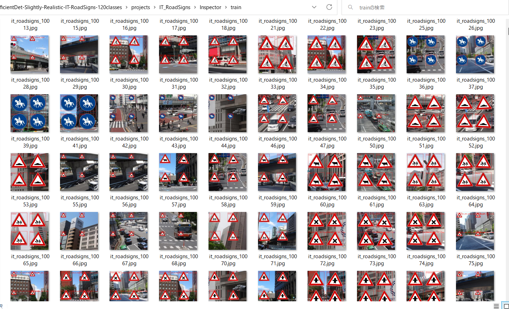
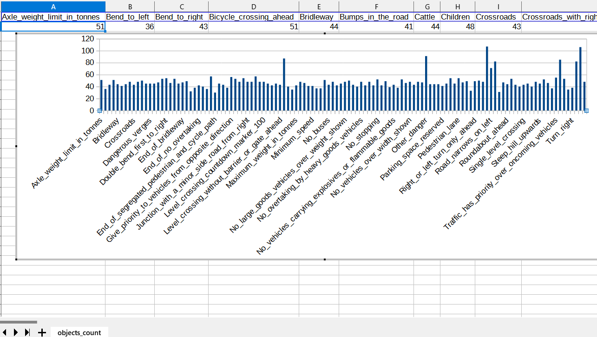
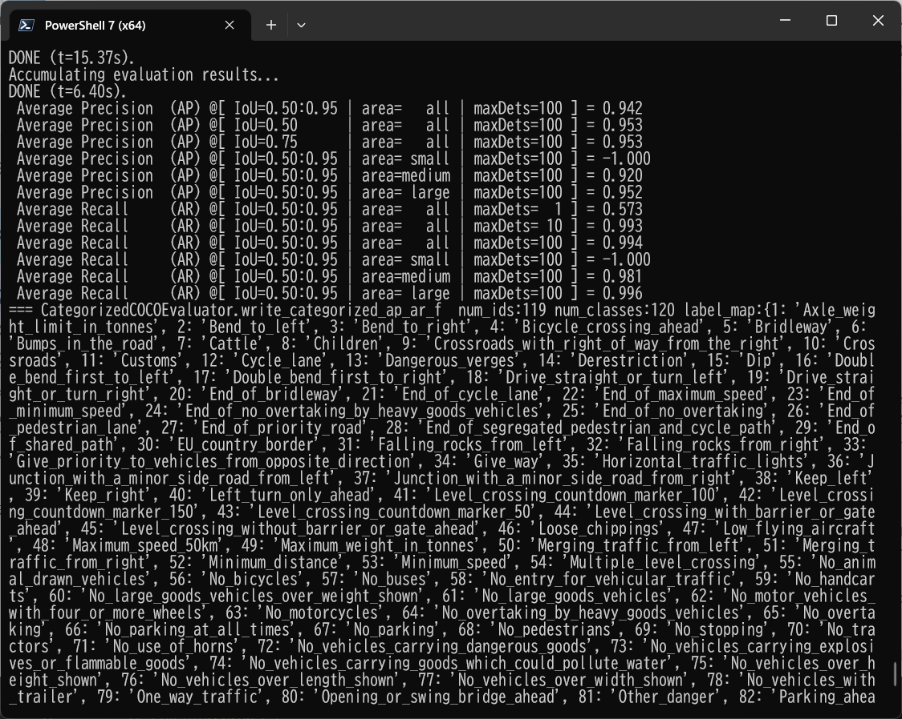
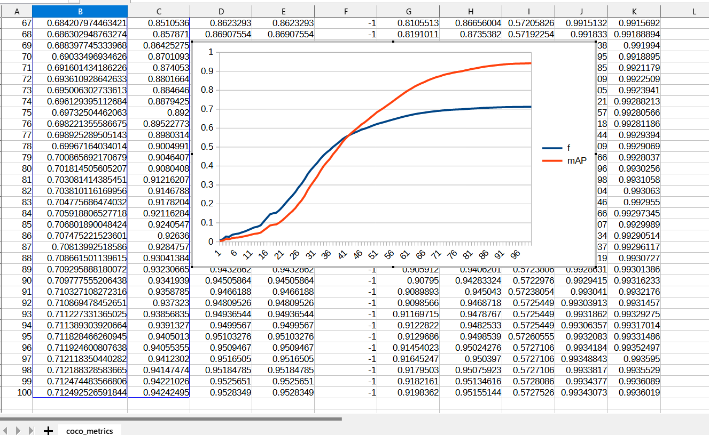
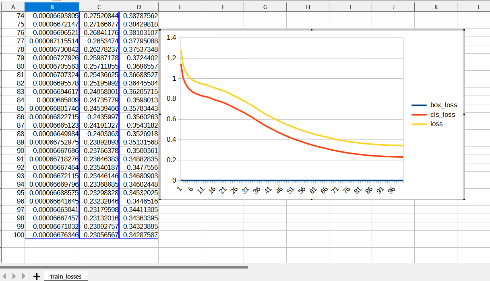
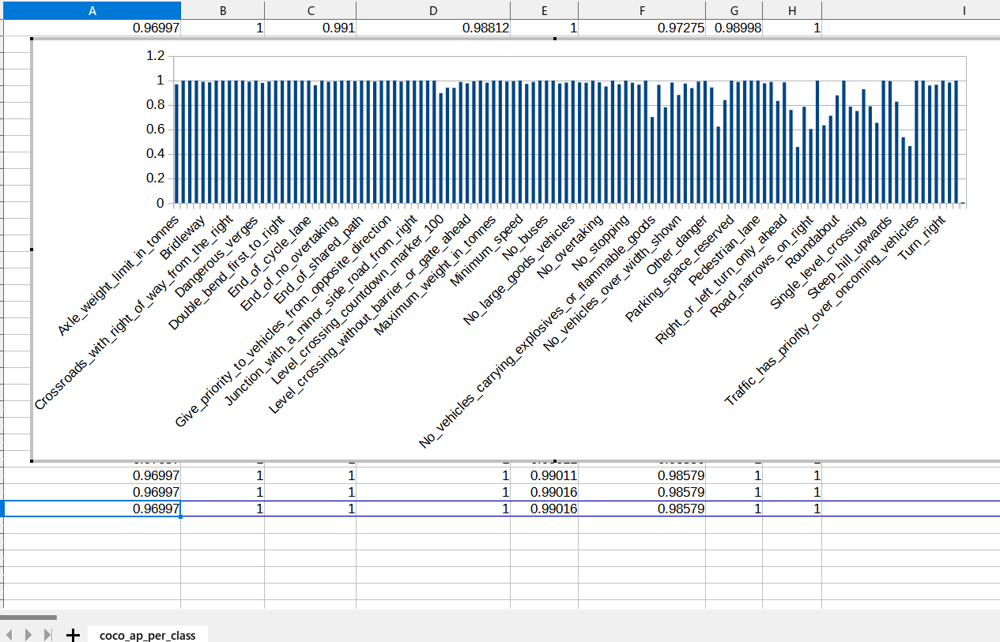
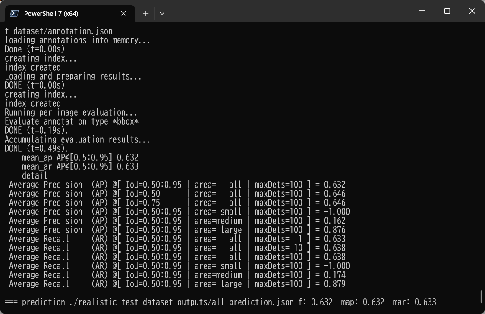

<h2>
EfficientDet-Slightly-Realistic-IT-RoadSigns-120classes (Updated: 2023/02/20)
</h2>

<h2>
1. Installing tensorflow on Windows11
</h2>
We use Python 3.8.10 to run tensoflow 2.8.0 on Windows11. 
<h3>1.1 Install Microsoft Visual Studio Community</h3>
Please install <a href="https://visualstudio.microsoft.com/ja/vs/community/">Microsoft Visual Studio Community</a>, 
which can be ITed to compile source code of 
<a href="https://github.com/cocodataset/cocoapi">cocoapi</a> for PythonAPI. 
<h3>1.2 Create a python virtualenv </h3>
Please run the following command to create a python virtualenv of name <b>py38-efficientdet</b>.
<pre>
>cd c:\
>python38\python.exe -m venv py38-efficientdet
>cd c:\py38-efficientdet
>./scripts/activate
</pre>
<h3>1.3 Create a working folder </h3>
Please create a working folder "c:\google" for your repository, and install the python packages. 

<pre>
>mkdir c:\google
>cd    c:\google
>pip install cython
>git clone https://github.com/cocodataset/cocoapi
>cd cocoapi/PythonAPI
</pre>
You have to modify extra_compiler_args in setup.py in the following way:
<pre>
   extra_compile_args=[]
</pre>
<pre>
>python setup.py build_ext install
</pre>

 
<h2>
2. Installing EfficientDet-Realistic-IT-RoadSigns-120classes
</h2>
<h3>2.1 Clone repository</h3>
Please clone EfficientDet-Slightly-Realistic-IT-RoadSigns-120classes.git in the working folder <b>c:\google</b>. 
<pre>
>git clone https://github.com/atlan-antillia/EfficientDet-Slightly-Realistic-IT-RoadSigns-120classes.git 
</pre>
You can see the following folder <b>projects</b> in  EfficientDet-Slightly-Realistic-IT-RoadSigns-120classes of the working folder. 

<pre>
EfficientDet-Slightly-Realistic-IT-RoadSigns-120classes
└─projects
    └─IT_RoadSigns
        ├─eval
        ├─saved_model
        │  └─variables
        ├─realistic_test_dataset
        └─realistic_test_dataset_outputs
</pre>
<h3>2.2 Install python packages</h3>

Please run the following command to install python packages for this project. 
<pre>
>cd ./EfficientDet-Slightly-Realistic-IT-RoadSigns-120classes
>pip install -r requirements.txt
</pre>

 
<h3>2.3 Download TFRecord dataset</h3>
 You can create TRecord_IT_RoadSigns 120classe dataset by using the following project 
<a href="https://github.com/sarah-antillia/Realistic-AutoAnnotation-Tool/tree/main/projects/IT_RoadSigns_120classes">Realistic-AutoAnnotation-Tool</a>
 
The created train and valid TFRecord dataset must be copied into ./projects/IT_RoadSigns folder.
<pre>
└─projects
    └─IT_RoadSigns
        ├─train
        └─valid
</pre>
The train and valid folders contain the following tfrecord files: 
<pre>
    └─IT_RoadSigns
        ├─train
        │  └─train.tfrecord
        └─valid
           └─valid.tfrecord
</pre>

<h3>2.4 Workarounds for Windows</h3>
As you know or may not know, the efficientdet scripts of training a model and creating a saved_model do not 
run well on Windows environment in case of tensorflow 2.8.0 (probably after the version 2.5.0) as shown below:. 
<pre>
INFO:tensorflow:Saving checkpoints for 0 into ./models\model.ckpt.
I0609 06:22:50.961521  3404 basic_session_run_hooks.py:634] Saving checkpoints for 0 into ./models\model.ckpt.
2022-06-09 06:22:52.780440: W tensorflow/core/framework/op_kernel.cc:1745] OP_REQUIRES failed at save_restore_v2_ops.cc:110 :
 NOT_FOUND: Failed to create a NewWriteableFile: ./models\model.ckpt-0_temp\part-00000-of-00001.data-00000-of-00001.tempstate8184773265919876648 :
</pre>

The real problem seems to happen in the original <b> save_restore_v2_ops.cc</b>. The simple workarounds to the issues are 
to modify the following tensorflow/python scripts in your virutalenv folder. 
<pre>
c:\py38-efficientdet\Lib\site-packages\tensorflow\python\training
 +- basic_session_run_hooks.py
 
634    logging.info("Saving checkpoints for %d into %s.", step, self._save_path)
635    ### workaround date="2022/06/18" os="Windows"
636    import platform
637    if platform.system() == "Windows":
638      self._save_path = self._save_path.replace("/", "\\")
639    #### workaround
</pre>

<pre>
c:\py38-efficientdet\Lib\site-packages\tensorflow\python\saved_model
 +- builder_impl.py

595    variables_path = saved_model_utils.get_variables_path(self._export_dir)
596    ### workaround date="2022/06/18" os="Windows" 
597    import platform
598    if platform.system() == "Windows":
599      variables_path = variables_path.replace("/", "\\")
600    ### workaround
</pre>
 
<h3>3. Inspect tfrecord</h3>
  Move to ./projects/IT_RoadSigns directory, and run the following bat file: 
<pre>
tfrecord_inspect.bat
</pre>
, which is the following:
<pre>
python ../../TFRecordInspector.py ^
  ./train/*.tfrecord ^
  ./label_map.pbtxt ^
  ./Inspector/train
</pre>
 
This will generate annotated images with bboxes and labels from the tfrecord, and cout the number of annotated objects in it. 
 
<b>TFRecordInspecotr: annotated images in train.tfrecord</b> 

 
 
<b>TFRecordInspecotr: objects_count train.tfrecord</b> 

 
This bar graph shows that the number of the objects contained in train.tfrecord.
 
 
 
<h3>4. Downloading the pretrained-model efficientdet-d0</h3>
Please download an EfficientDet model chekcpoint file <b>efficientdet-d0.tar.gz</b>, and expand it in <b>EfficientDet-IT-RoadSigns</b> folder. 
 
https://storage.googleapis.com/cloud-tpu-checkpoints/efficientdet/coco2/efficientdet-d0.tar.gz
 
See: https://github.com/google/automl/tree/master/efficientdet 

<h3>5. Training IT RoadSigns Model by ITing pretrained-model</h3>
Please change your current directory to <b>./projects/IT_RoadSigns</b>,
and run the following bat file to train IT-Roadsigns Efficientdet Model by ITing the train and valid tfrecords.
<pre>
1_train.bat
</pre>

<pre>
rem 1_train.bat: modified --model_dir
python ../../ModelTrainer.py ^
  --mode=train_and_eval ^
  --train_file_pattern=./train/*.tfrecord  ^
  --val_file_pattern=./valid/*.tfrecord ^
  --model_name=efficientdet-d0 ^
  --hparams="input_rand_hflip=False,image_size=512x512,num_classes=120,label_map=./label_map.yaml" ^
  --model_dir=./models ^
  --label_map_pbtxt=./label_map.pbtxt ^
  --eval_dir=./eval ^
  --ckpt=../../efficientdet-d0  ^
  --train_batch_size=4 ^
  --early_stopping=map ^
  --patience=10 ^
  --eval_batch_size=1 ^
  --eval_samples=1000  ^
  --num_examples_per_epoch=2000 ^
  --num_epochs=100 
</pre>

<table style="border: 1px solid #000;">
<tr>
<td>
--mode</td><td>train_and_eval</td>
</tr>
<tr>
<td>
--train_file_pattern</td><td>./train/*.tfrecord</td>
</tr>
<tr>
<td>
--val_file_pattern</td><td>./valid/*.tfrecord</td>
</tr>
<tr>
<td>
--model_name</td><td>efficientdet-d0</td>
</tr>
<tr><td>
--hparams</td><td>"input_rand_hflip=False,num_classes=120,label_map=./label_map.yaml"
</td></tr>
<tr>
<td>
--model_dir</td><td>./models</td>
</tr>
<tr><td>
--label_map_pbtxt</td><td>./label_map.pbtxt
</td></tr>

<tr><td>
--eval_dir</td><td>./eval
</td></tr>

<tr>
<td>
--ckpt</td><td>../../efficientdet-d0</td>
</tr>
<tr>
<td>
--train_batch_size</td><td>4</td>
</tr>
<tr>
<td>
--early_stopping</td><td>map</td>
</tr>
<tr>
<td>
--patience</td><td>10</td>
</tr>

<tr>
<td>
--eval_batch_size</td><td>1</td>
</tr>
<tr>
<td>
--eval_samples</td><td>1000</td>
</tr>
<tr>
<td>
--num_examples_per_epoch</td><td>2000</td>
</tr>
<tr>
<td>
--num_epochs</td><td>100</td>
</tr>
</table>
 
 
<b>label_map.yaml:</b>
<pre>
1: 'Axle_weight_limit_in_tonnes'
2: 'Bend_to_left'
3: 'Bend_to_right'
4: 'Bicycle_crossing_ahead'
5: 'Bridleway'
6: 'Bumps_in_the_road'
7: 'Cattle'
8: 'Children'
9: 'Crossroads_with_right_of_way_from_the_right'
10: 'Crossroads'
11: 'Customs'
12: 'Cycle_lane'
13: 'Dangerous_verges'
14: 'Derestriction'
15: 'Dip'
16: 'Double_bend_first_to_left'
17: 'Double_bend_first_to_right'
18: 'Drive_straight_or_turn_left'
19: 'Drive_straight_or_turn_right'
20: 'End_of_bridleway'
21: 'End_of_cycle_lane'
22: 'End_of_maximum_speed'
23: 'End_of_minimum_speed'
24: 'End_of_no_overtaking_by_heavy_goods_vehicles'
25: 'End_of_no_overtaking'
26: 'End_of_pedestrian_lane'
27: 'End_of_priority_road'
28: 'End_of_segregated_pedestrian_and_cycle_path'
29: 'End_of_shared_path'
30: 'EU_country_border'
31: 'Falling_rocks_from_left'
32: 'Falling_rocks_from_right'
33: 'Give_priority_to_vehicles_from_opposite_direction'
34: 'Give_way'
35: 'Horizontal_traffic_lights'
36: 'Junction_with_a_minor_side_road_from_left'
37: 'Junction_with_a_minor_side_road_from_right'
38: 'Keep_left'
39: 'Keep_right'
40: 'Left_turn_only_ahead'
41: 'Level_crossing_countdown_marker_100'
42: 'Level_crossing_countdown_marker_150'
43: 'Level_crossing_countdown_marker_50'
44: 'Level_crossing_with_barrier_or_gate_ahead'
45: 'Level_crossing_without_barrier_or_gate_ahead'
46: 'Loose_chippings'
47: 'Low_flying_aircraft'
48: 'Maximum_speed_50km'
49: 'Maximum_weight_in_tonnes'
50: 'Merging_traffic_from_left'
51: 'Merging_traffic_from_right'
52: 'Minimum_distance'
53: 'Minimum_speed'
54: 'Multiple_level_crossing'
55: 'No_animal_drawn_vehicles'
56: 'No_bicycles'
57: 'No_buses'
58: 'No_entry_for_vehicular_traffic'
59: 'No_handcarts'
60: 'No_large_goods_vehicles_over_weight_shown'
61: 'No_large_goods_vehicles'
62: 'No_motor_vehicles_with_four_or_more_wheels'
63: 'No_motorcycles'
64: 'No_overtaking_by_heavy_goods_vehicles'
65: 'No_overtaking'
66: 'No_parking_at_all_times'
67: 'No_parking'
68: 'No_pedestrians'
69: 'No_stopping'
70: 'No_tractors'
71: 'No_use_of_horns'
72: 'No_vehicles_carrying_dangerous_goods'
73: 'No_vehicles_carrying_explosives_or_flammable_goods'
74: 'No_vehicles_carrying_goods_which_could_pollute_water'
75: 'No_vehicles_over_height_shown'
76: 'No_vehicles_over_length_shown'
77: 'No_vehicles_over_width_shown'
78: 'No_vehicles_with_trailer'
79: 'One_way_traffic'
80: 'Opening_or_swing_bridge_ahead'
81: 'Other_danger'
82: 'Parking_ahead_in_the_direction_of_the_arrow'
83: 'Parking_place'
84: 'Parking_prohibited_at_certain_times_and_allowed_in_others'
85: 'Parking_space_reserved'
86: 'Pass_either_side'
87: 'Pedestrian_crossing_ahead'
88: 'Pedestrian_crossing'
89: 'Pedestrian_lane'
90: 'Priority_road'
91: 'Quayside_or_river_bank'
92: 'Restricted_vehicular_access'
93: 'Right_or_left_turn_only_ahead'
94: 'Right_turn_only_ahead'
95: 'Risk_of_fire'
96: 'Road_narrows_on_left'
97: 'Road_narrows_on_right'
98: 'Road_narrows'
99: 'Road_works'
100: 'Roundabout_ahead'
101: 'Roundabout'
102: 'Segregated_pedestrian_and_cycle_path'
103: 'Shared_path'
104: 'Side_winds'
105: 'Single_level_crossing'
106: 'Slippery_road'
107: 'Snow_chains_compulsory'
108: 'Steep_hill_downwards'
109: 'Steep_hill_upwards'
110: 'Stop_and_give_way'
111: 'Stop_pay_toll'
112: 'Stop_police_roadblock'
113: 'Traffic_has_priority_over_oncoming_vehicles'
114: 'Traffic_lights'
115: 'Trams_crossing_ahead'
116: 'Turn_left'
117: 'Turn_right'
118: 'Two_way_traffic'
119: 'Uneven_road'
120: 'Wild_animals'
</pre>
 
 
<b><a href="./projects/IT_RoadSigns/eval/coco_metrics.csv">COCO metrics at epoch 100</a></b> 

 

 
<b><a href="./projects/IT_RoadSigns/eval/coco_metrics.csv">COCO meticss f and map</a></b> 

 
 
<b><a href="./projects/IT_RoadSigns/eval/train_losses.csv">Train losses</a></b> 

 
 

<b><a href="./projects/IT_RoadSigns/eval/coco_ap_per_class.csv">COCO ap per class</a></b> 

 

<h3>
6. Create a saved_model from the checkpoint
</h3>
  Please run the following bat file to create a saved_model from the checkpoint files in <b>./models</b> folder.  
<pre>
2_create_saved_model.bat
</pre>
, which is the following:
<pre>
rem 2_create_saved_model.bat  modified 2022/06/18
python ../../SavedModelCreator.py ^
  --runmode=saved_model ^
  --model_name=efficientdet-d0 ^
  --ckpt_path=./models  ^
  --hparams="image_size=512x512,num_classes=120" ^
  --saved_model_dir=./saved_model
</pre>

<table style="border: 1px solid #000;">
<tr>
<td>--runmode</td><td>saved_model</td>
</tr>

<tr>
<td>--model_name </td><td>efficientdet-d0 </td>
</tr>

<tr>
<td>--ckpt_path</td><td>./models</td>
</tr>

<tr>
<td>--hparams</td><td>"image_size=512x512,num_classes=120"</td>
</tr>

<tr>
<td>--saved_model_dir</td><td>./saved_model</td>
</tr>
</table>

 
 
<h3>
7. Inference IT_road_signs by using the saved_model
</h3>
<h3>7.1 Inference scripts</h3>
 Please run the following bat file to infer the roadsigns in images of test_dataset:
<pre>
3_inference.bat
</pre>
, which is the folllowing:
<pre>
rem 3_inference.bat
python ../../SavedModelInferencer.py ^
  --runmode=saved_model_infer ^
  --model_name=efficientdet-d0 ^
  --saved_model_dir=./saved_model ^
  --min_score_thresh=0.4 ^
  --hparams="num_classes=120,label_map=./label_map.yaml" ^
  --input_image=./realistic_test_dataset/*.jpg ^
  --classes_file=./classes.txt ^
  --ground_truth_json=./realistic_test_dataset/annotation.json ^
  --output_image_dir=./realistic_test_dataset_outputs
</pre>

<table style="border: 1px solid #000;">
<tr>
<td>--runmode</td><td>saved_model_infer </td>
</tr>
<tr>
<td>--model_name</td><td>efficientdet-d0 </td>
</tr>

<tr>
<td>--saved_model_dir</td><td>./saved_model </td>
</tr>

<tr>
<td>--min_score_thresh</td><td>0.4 </td>
</tr>

<tr>
<td>--hparams</td><td>"num_classes=120,label_map=./label_map.yaml"</td>
</tr>

<tr>
<td>--input_image</td><td>./realistic_test_dataset/*.jpg</td>
</tr>

<tr>
<td>--classes_file</td><td>./classes.txt</td>
</tr>

<tr>
<td>--ground_truth_json</td><td>./realistic_test_dataset/annotation.json</td>
</tr>

<tr>
<td>--output_image_dir</td><td>./realistic_test_dataset_outputs</td>
</tr>
</table>

 
<h3>
7.2. Some Inference results of IT RoadSigns
</h3>

 
<a href="./projects/IT_RoadSigns/realistic_test_dataset_outputs/IT_roadsigns_1001.jpg_objects.csv">roadsigns1001.jpg_objects.csv</a> 
 
 
<a  href="./projects/IT_RoadSigns/realistic_test_dataset_outputs/IT_roadsigns_1012.jpg_objects.csv">roadsigns1002.jpg_objects.csv</a> 
 
 
<a  href="./projects/IT_RoadSigns/realistic_test_dataset_outputs/IT_roadsigns_1023.jpg_objects.csv">roadsigns1003.jpg_objects.csv</a> 
 
 
<a  href="./projects/IT_RoadSigns/realistic_test_dataset_outputs/IT_roadsigns_1034.jpg_objects.csv">roadsigns1004.jpg_objects.csv</a> 
 
 
<a  href="./projects/IT_RoadSigns/realistic_test_dataset_outputs/IT_roadsigns_1045.jpg_objects.csv">roadsigns1005.jpg_objects.csv</a> 
 
 
<a  href="./projects/IT_RoadSigns/realistic_test_dataset_outputs/IT_roadsigns_1056.jpg_objects.csv">roadsigns1006.jpg_objects.csv</a> 
 
 
<a  href="./projects/IT_RoadSigns/realistic_test_dataset_outputs/IT_roadsigns_1067.jpg_objects.csv">roadsigns1007.jpg_objects.csv</a> 
 
 
<a  href="./projects/IT_RoadSigns/realistic_test_dataset_outputs/IT_roadsigns_1078.jpg_objects.csv">roadsigns1008.jpg_objects.csv</a> 
 
 
<a  href="./projects/IT_RoadSigns/realistic_test_dataset_outputs/IT_roadsigns_1089.jpg_objects.csv">roadsigns1009.jpg_objects.csv</a> 
 
 
<a  href="./projects/IT_RoadSigns/realistic_test_dataset_outputs/IT_roadsigns_1099.jpg_objects.csv">roadsigns1010.jpg_objects.csv</a> 
 

<h3>7.3. COCO metrics of inference result</h3>
The 3_inference.bat computes also the COCO metrics(f, map, mar) to the <b>realistic_test_dataset</b> as shown below: 
<a href="./projects/IT_RoadSigns/realistic_test_dataset_outputs/prediction_f_map_mar.csv">prediction_f_map_mar.csv</a>

 
 
